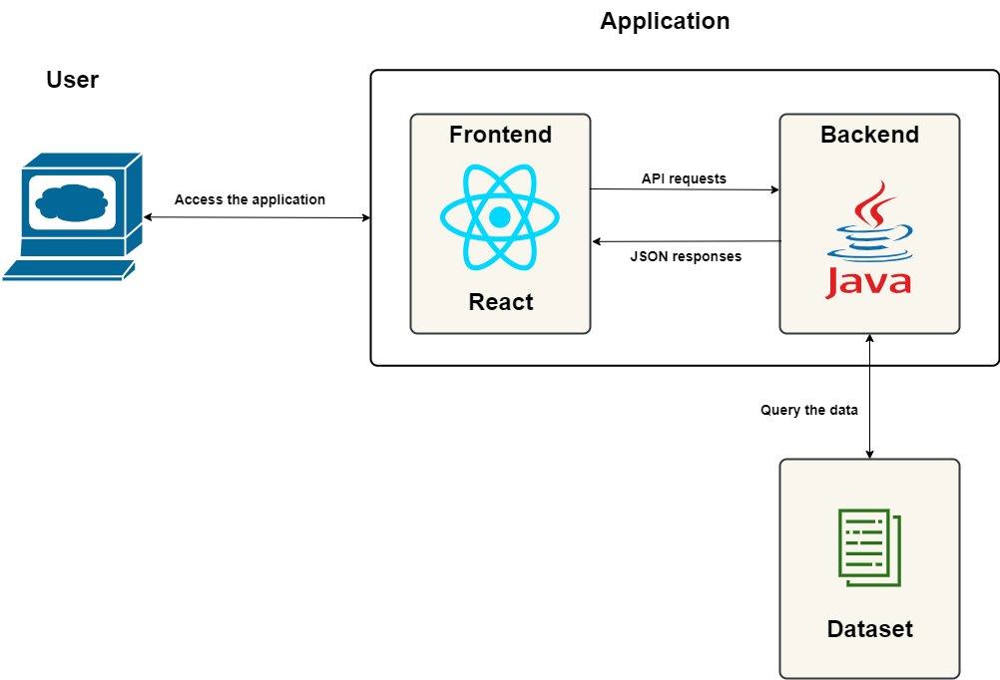

### Description

US Employment rates application provides an good starter to build a 2 tier microservice application and deploy it on any platforms like Kubernetes and OpenShift. It shows the US Employment and Unemployment rates since 1940 from USA Bureau of Labor Statistics. The application consists of a **Dataset** , **React** based Frontend and **Java using Spring** backend.

Before to install this application you need to install the Employment dataset.

### Architecture

This stack consists of a Java backend and a React frontend that are displaying data from a dataset. The frontend build using React is included in the Java backend. 

**Stack Components:**

1. **Java (Back-End Framework)**

   Java is the #1 programming language and development platform. It reduces costs, shortens development timeframes, drives innovation, and improves application services.

   **Why use Java?**

   - Java is an easy to learn Object-Oriented Programming Language
   - Provides a robust set of features for desktop, web and mobile applications
   - Powerful development tools e.g., Eclipse, Netbeans
   - Great collection of Open Source libraries
   - Wonderful Community Support
   - Java is FREE
   - Excellent documentation support - Javadocs
   - Java is Platform Independent
   - Creating efficient and robust API is quick and easy.

2. **Spring (Back-End Framework)**

   The Spring Framework is an application framework and inversion of control container for the Java platform. The framework's core features can be used by any Java application, but there are extensions for building web applications on top of the Java EE (Enterprise Edition) platform.

   **Why use Spring?**

   - Spring’s flexible libraries are trusted by developers all over the world. Spring delivers delightful experiences to millions of end-users every day—whether that’s streaming TV, connected cars, online shopping, or countless other innovative solutions. Spring also has contributions from all the big names in tech, including Alibaba, Amazon, Google, Microsoft, and more.
   - Spring makes programming Java quicker, easier, and safer for everybody.
   - Spring’s flexible and comprehensive set of extensions and third-party libraries let developers build almost any application imaginable.
   - Spring Boot transforms how you approach Java programming tasks, radically streamlining your experience. 
   - Spring cares about performance. With Spring, you’ll notice fast startup, fast shutdown, and optimized execution, by default.
   - Spring has a proven track record of dealing with security issues quickly and responsibly. The Spring committers work with security professionals to patch and test any reported vulnerabilities. Third-party dependencies are also monitored closely
   - The Spring community is enormous, global, diverse, and spans folks of all ages and capabilities, from complete beginners to seasoned pros.

2. **React (Front-End Framework)**

   React is basically a JavaScript library for building user interfaces. It is easy, efficient and painless way to create Interactive UIs. It is maintained by Facebook and a community of individual developers and companies. Design simple views for each state in your application, and React will efficiently update and render just the right components when your data changes and for this reason only, it is used for developing single-page application or mobile applications.

   **Why use React?**

   - Virtual DOM in ReactJS makes user experience better and developer’s work faster
   - It guarantees stable code.
   - React allows its components to be reused saving time and effort.
   - Provides high performance.
   - Provide the feature of Virtual DOM.
   - SEO friendly!

*Code sample provided and maintained by EDGE team.*